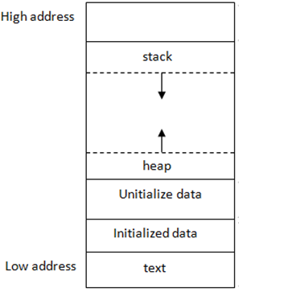
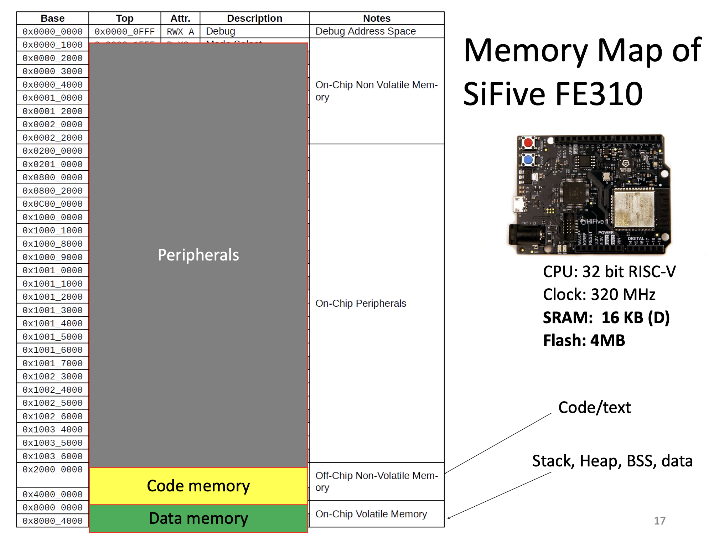

## memory layout

**contents**

1.  [memory layout of c programs](#memory-layout-of-c-programs)

## memory layout of c programs

[stack and heap memory](https://courses.engr.illinois.edu/cs225/sp2022/resources/stack-heap/)

a typical memory representation of c program consists of three broad regions:

1.  static data

-  fixed size
-  stays for the entire program
-  read only
-  low addresses
-  read from program file by exe
-  text/code segment
-  initialized data
-  uninitialized data segment

2.  stack

-  variable size
-  grows when calling function

3.  heap

-  variable size
-  grows when allocated in programs



## text segment

-  contains executable instructions
-  placed below the heap or stack in order to prevent heaps and stack overflows from overwriting it
-  the text segment is often read-only -> to prevent a program from accidentally modifying its instructions.

## initialized data segment

-  also just called "data segment"
-  contains the global variables and static variables that are initialized in the code
-  data segment is not read-only, since the values of the variables can be altered at run time

```c
int a = 1;
```

## uninitialized data segment

-  often called "bss"
-  contains all global variables and static variables that are initialized to zero
-  or do not have explicit initialization in source code

```c
int a;
int a = 0;
```

## static variable

-  static variables preserve their previous value in their previous scope and are not initialized again in the new scope.

```c
#include <stdio.h>
int fun() {
    static int count = 0;
    count++;
    return (count);
}

int main() {
    printf("%d ", fun());
    printf("%d ", fun());
    return (0);
}
```

## example

```c
#include <stdio.h>

int main(void) {
    return 0;
}
```

```zsh
❯ gcc main.c -o main
❯ size main
__TEXT	__DATA	__OBJC	others	dec	hex
16384	0	0	4294983680	4295000064	100008000
```

## example:  global variables

## example:  static variables

## example:  initialized static variables

## stack

-  temporary storage for functions
-  grows and shrinks dynamically
    -  call a function -> grow / push a frame on the stack
    -  return from a function -> shrink / pop a frame from the stack
-  stack frame
    -  local variables
    -  input parameters
    -  return address/value
    -  previous stack frame pointer

## stack example

```c
int main() {
    // ...
    f1();
    return(0);
}

int f1() {
    // ...
    f2();
    return(0);
}

void f2() {
    // ...
    f3();
}

void f3() {
    // ...
}
```
**sample entry sequence**
```asm
addi sp, sp, -8
sw ra, 0(sp)
sw s0, 4(sp)
```

**corresponding exit sequence**
```asm
lw ra, 0(sp)
lw a0, 4(sp)
addi sp, sp, 8
```

## heap

-  segment where dynamic memory allocation takes place
-  reserved at compile time
-  allocated/freed at runtime
    -  `malloc()`
    -  `free()`

```c
// dynamically allocate memory using malloc()
ptr = (int*)malloc(n * sizeof(int));
```
## data memory (data segment)

-  stack:  temporary data like local variables
-  heap:  hynamically allocated data (e.g. using malloc(), or new in c++)
-  data:  non zero initialized global and static data
-  bss (block started by symbol):  zero initialized and uninitialized global and static data

```c
int globA; // bss
int globB = 1; // data
int main () {  
    int varA;  // stack
    int varB = 10; // stack
    static int varC = 0; // bss
    static int varE = 1; // data
    char *varD;         // stack
    varD = (char*)malloc(8);  // heap
    varA = varB + varC;
    return varA; 
}
```

## memory map of sifive FE310



-  peripherals are mapped to the address space, they are the medium through which you can interact with the hardware, where you send data and recieve data
-  code memory is where the program is stored, it's off-chip non-volatile memory (flash) which is read-only and is always going to be stored irrespective if the machine is off or on
-  data memory is where the data is stored, it's on-chip volatile memory (SRAM) which is read-write and is only stored only when the machine is on

##  context

-  memory mapped i/o
-  memory segments

##  memory map

-  cpu's view of the physical memory
-  segregated with multiple regions
-  different memory type for each region
-  each platform may have different mappings

## interfacing with i/o devices

**port-mapped i/o**
-  use a separate address space for i/o device and use special instructions to access the i/o memory

**memory mapped i/o**
-  i/o memory is mapped into the cpu address space

**use load/store instruction** to communicate with i/o devices


