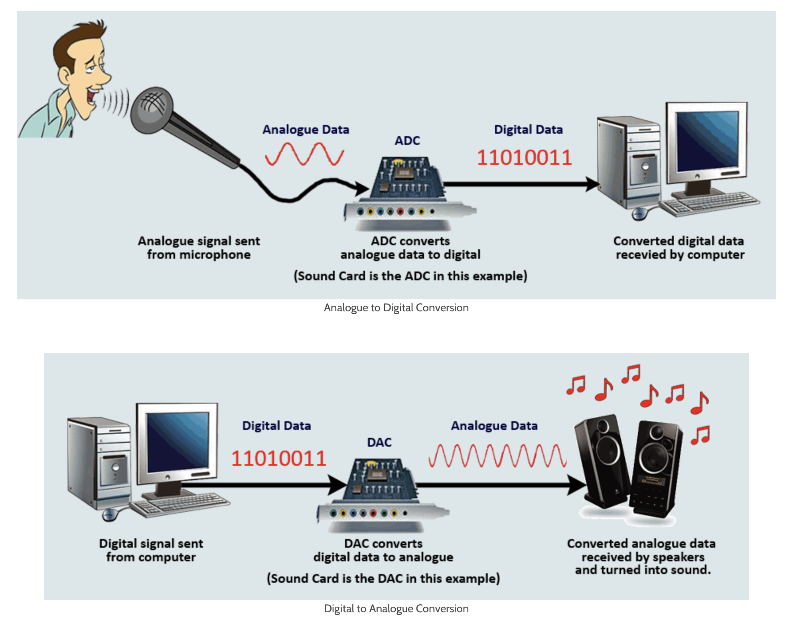
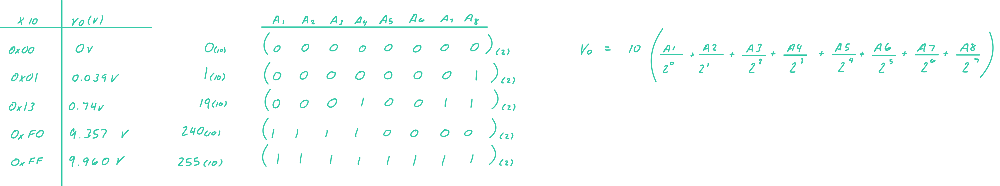

# i/o devices adc / dac

**content**

1.  [context](#context)

## context

-  adc analog to digital convrter  convert an analog signal to a digital one
-  dac digital to analog converter  convert a digital signal into an analog one

## analog to digital, dgital to analog

## dac0808 8 bit d/a converter

-  the digital inputs are converted into a current $I_{out}$
-  the total current provided by the $I_{out}$ pin is basically a function of the binary numbers bat the input pins a1 - a8
-  the $I_{ref}$ is the input current.  this must be provided into the pin 14 by connecting a resistor.  generally 2.0mA is used as $I_{ref}$

$$I_{out} = I_{ref}\left(\frac{a1}{2} + \frac{a2}{4} + \cdots + \frac{a8}{256}\right)$$

## using the dac

**the reference pin**

-  a `+10V` power source is connected as reference voltage for the device and the negative reference is grounded.
-  reference voltage defines the output voltage range of analog output signal from op-amp output.  
-  if Vref = 10v, when all inputs are high => Vout = 10v

## inside dac 0808

## dac resolution

## question

-  say we are sending data to dac from 8-bit gpio
-  considering the following +10 dav, fill in the table

| x10  | Vo (V) |
|:----:|:------:|
| 0x00 | 0V     |
| 0x01 | 0.039V |
| 0x13 | 0.74V  |
| 0xFO | 9.357V |
| 0xFF | 9.960V |

**calaculation**

