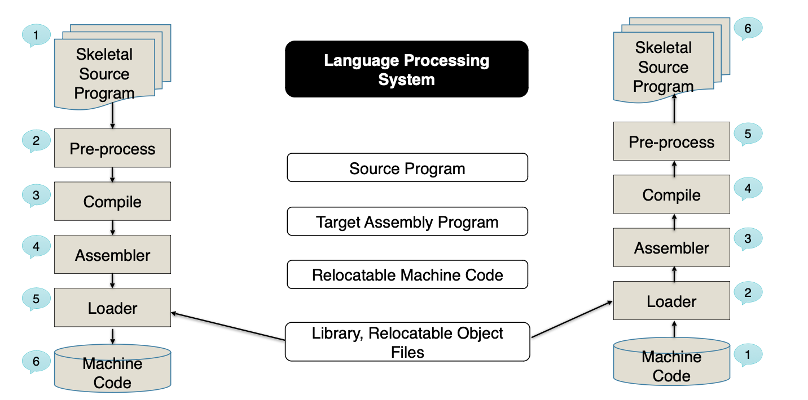

#  reverse engineering

##  intro

##  bitsteam / binary / software reverse engineering

-  understand the properties of machine code/object code
-  each architecture has fixed set of opcode, operand and register naming
-  can be static or dynamic
-  in digital electronics, a bitstream is similar to the sequence of binary digits but implies configuration of a programmable device or ASIC.

##  why reverse engineering

-  legitimate purposes:  
    -  understand the program
    -  identify vulnerabilities / weaknesses
    -  analyze security vulnerabilities

-  malicious purposes
    -  unauthorized overproduction / ip piracy
    -  develop malware / create malicious version
    -  trojan insertion

##  reverse engineering in embedded devices
