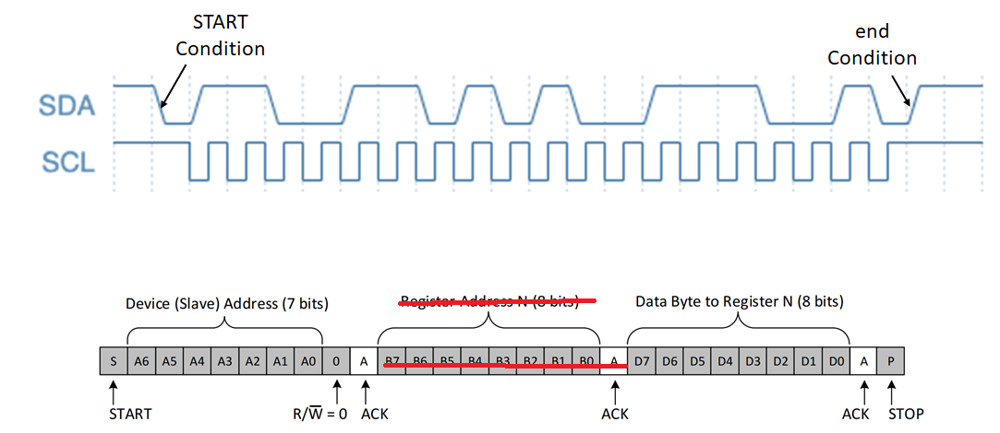

#  homework 4

1.  indicate which of the following features better describes a point-to-point and bus network

    sharing of data line among multiple devices:  bus network

    area efficient: bus network

    use of master and slave device concept:  bus network

    No need for arbitration mechanism:  point to point

    fast communication among devices:  point to point 

2.  during the execution of program a, device b interrupts.  after a while when isr of device b is executing the `AND` instruction, device c interrupts.  ret indicates end of a program.  based on the time of interrupt request from the devices and the execution flow of the programs, match the program/device with their priority levels by drawing lines:

    device c:  mid priority

    device b:  highest priority

    program a:  lowest priority

3.  the following stream of bits starting with idle bits is encoded in `RS232` frame format where the data segment is 1 byte and has 1 parity bit.  what is the actual data byte?

    111111100001001101111111

    answer:  00010011

4.  si-five interrupt architecture, which of the following cases are handled by core local interrupts (clint)?  you can choose multiple

    interrupt from i2c:  no

    software interrupts:  yes

    timer interrupts:  yes

    interrupt from uart:  no

5.  the following figure conatins a waveform of scl and sda of an i2c bus along with the format of the data frame.  assume that the particular slave device only has one register.  therefore, no register address is needed (crossed out).  based on these two figures, match the correct value for slave address, data, and r/w bit in the sda waveform. 

    

    r/w bit:  1

    data byte:  10011100

    device slave address (7 bits):  1100110

6.  which are the features of inter-integrated circuit protoccol i2c?

    asynchronous and serial communication: no

    support for only one master but many slave devices:  no

    support for multiple master and slave devices:  yes

    synchronous and serial communication:  yes

7.  match the communication device with their appropriate communication types (simplex, half duplex, full duplex).

    walkie-talkie:  half duplex

    device in serial peripheral interface communication:  full duplex

    telephone:  full duplex

    television broadcasting:  simplex

    device in inter-integrated circuit protocol (i2c):  half duplex

    wired speakers:  simplex

8.  suppose you are sending data over a uart interface at a baud rate fo 1024 bps.  the channel is short so we don't use any parity bit for error detection.  how long should it take to send a single 8-bit character using rs232 frame format?  consider 1 start and 2 stop bits

10.74 milliseconds
