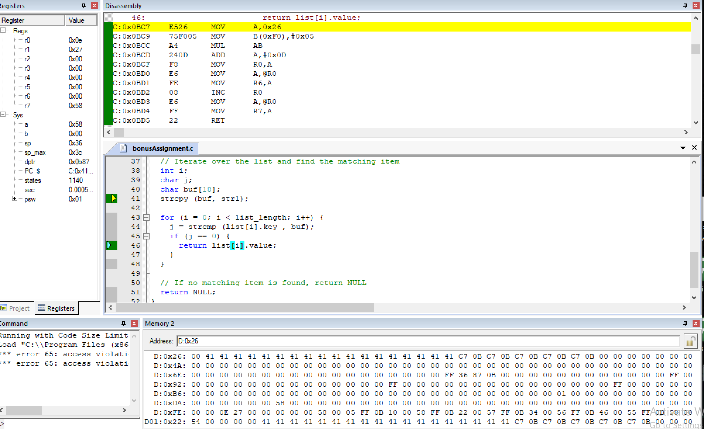

#  buffer overload attack

###  contents

1.  [intro](#intro)
2.  [tasks](#tasks)

###  intro

in this assignment, you will analyze a C program build for intel 8051 architecture using keil software and report the vulnerabilities. refer to the lecture slides and recording on how to obtain and use the tool.

an organization needs a program that reports an ssn/secret number based on the person's date of birth and their father's date of birth. the requirement of the program is strict such that only the person associated with the date of birth can only get their ssn/secret data. unfortunately, the library that is used to accept the user's input and compare it with the saved database has a buffer overflow vulnerability. as an attacker, you aim to collect all the possible secret data in the program by applying various input patterns in the `input_char.`

the target device for which the binary is generated is made by a vendor named “Microchip,” and the model of the device is “AT89C51”. the C program is attached with the homework.

###  tasks

1. develop a malicious input based on the buffer size to leak maximum number of SSN/secret number from the program. the attacker knows the length of the SSN/ secret number and it returns in the “r7” register during program execution. attach the snapshot of “register” window for every leaked SSN/ secret number. for example, in the attached snapshot below we observed value “0x55” in the “r7” register. also describe the procedure of creating malicious input step by step and finally show the malicious input. (12 points)


in order to develop this malicious input based on the buffer size to leak the maximum number of ssn/secret numbers from the program, i needed to understand the structure of the program and the buffer overflow vulnerability.  the progiram has a list of key value pairs where the key is a date of birth string and the value is the ssn/secret number.  there is a buffer `buf` of size 18 in the `get_item_from_list` function, which is used to store the input string.  the buffer overflow vulnerability occurs when the input string is larger than the buffer size, which can overwrite adjacent memory.

in order to have created to malicious input, i did the following:

-  identify the length of the ssn/secret number in the list, which is 18 characters in length.
-  create a long string that conatins numtiple date of birth strings from the list, separated by null character which will be treated as a string delimiter.
-  make sure the total length of the input string is larger than that of the buffer size which is `char buf[18]` aka 18 long

the following can be the input of the string.

```c
"00101201501012008\0" "00101201501012007\0" "00101201501012006\0" "00101201501012005\0" "00101201501012004\0"
```

this input string will cause a buffer overflow, and the program will leak multiple ssn/secret numbers when it overwrites the adjacent memory.  in order to show the results i neede to debug the program and observe the value of `r7` register for each leaked ssn/secret number.



2. what are the possible solutions for overcoming the buffer overflow issue in the prior code? modify the C program according to your solution and describe how it will prevent the buffer overflow. (8 points) 

in order to overcome the buff overflow issue, we can implement proper bounds checking when copying the input string to the buffer.  one solution is to use the `strncpy` instead of `strcpy`, which allows you to specify the maximum number of characters to be copied.  additionally, you should ensure the copied string is null terminated.  

the fucntion of course takes a string as input and seaches for the matching item in the list.  the list is an array of key value pairs, which each key is a string and each value is an integer.  the function first create a character array called buf[18]..  it will then use strncpy to copy the input tsirng `str1` `buf` limiting the number of character copied to the size of buf minus one.  this is done to of course prevent the attack.

```c
int get_item_from_list(char* str1) {
    // iterate over the list and find the matching item
    int i;
    char j;
    char buf[18];

    // use strncpy instead of strcpy to limit the number of characters copied
    strncpy(buf, str1, sizeof(buf) - 1);
    buf[sizeof(buf) - 1] = '\0';

    for (i = 0; i < list_length; i++) {
        j = strcmp(list[i].key, buf);
        if (j == 0) {
            return list[i].value;
        }
    }

    // if no matching item is found, return NULL
    return NULL;
}
```


