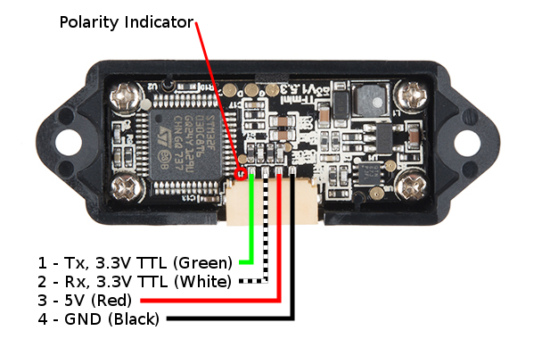
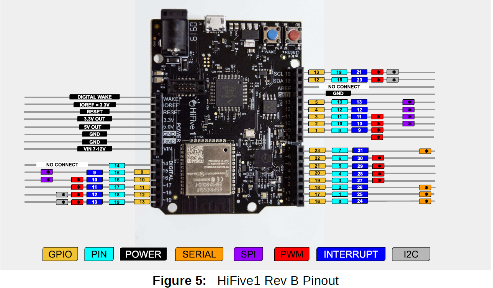

# sensor reading tfmini lidar

### contents

1.  [objective](#objective)
2.  [tfmini lidar](#tfmini-lidar)
3.  [tfmini sensor reader programming](#tfmini-sensor-reader-programming)
4.  [implement tfmini data frame reader](#implement-tfmini-data-frame-reader)
5.  [control led based on distance](#control-led-based-on-distance)
6.  [notes](#notes)
7.  [how the tfmini sends data](#how-the-tfmini-sends-data)
8.  [tasks](#tasks)

## objective

in this src, we will attach a small lidar sensor, which measures distance, to the hifive1 board via uart and develop software to read the sensor data.

## tfmini lidar

-  main product characteristics
-  this product is based on tof (time of flight) principle and integrated with unique optical and electrical designs, so as to achieve stable, precise, high sensitivity and high-speed distance detection.
-  it's operating range is from 0.3 m - 12 m
-  the communication interface is via `UART`
-  it's main applications is for drone altitude holding and terrain following, machine control and safety sensor, robot distance detection
-  TOF is an abbreviation of time of flight technology and its operating principle is as follows:  a modulated nearinfrared light is sent from the senor and reflect by an object; the distance to the object to be shot can be converted with the sensor by calculating the tie different or phase difference between the light sending and the light reflection, so as to produce the depth information.


**the tfmini sensor**



**hifive1 rev b pinout**



**connections**

|tfmini     | hifive1 board uart 0|
|:----------|:--------------------|
|tx (green) | rx `pin 0 = gpio 0` |
|rx (white) | tx `pin 1 = gpio 17`|
|5v (red)   | `5v` line           |
|gnd (black)| `gnd` line          |

-  now let's look at the datasheet of the tfmini lidar in order to find out how to retrieve data from the sensor.  the data exchange format of the sensor is described in section 6.1 standard data format serial port of teh data sheet 

-  [tfmini datasheet](./PlatformIO/docs/benewake-tfmini-datasheet.pdf)

**serial port data communication protocol and line sequence**

-  the following section describes the connections and communications between `TF_mini` and external devices, including the encoding format of sending data, the communication protocol between the module and the external devices, the hardware line connection indications, and related precaustions.

| communication protocol | `UART` |
|:-----------------------|:-------|
| baud rate              | 115200 |
| data bits              | 8      |
| stop bits              | 1      |
| parity                 | none   |

-  **baud rate**  is a common unit of measurement of symbol rate, which is one of the components that determine the speed of communication over a data channel. It is the unit for symbol rate or modulation rate in symbols per second or pulses per second

**standard data format of serial port**

-  the module data is a hexadecimal output data
-  each frame data is encoded with `9 bytes`
-  including 1 distance data (Dist)
-  each distance data has corresponding signal strength information (strength)
-  the frame end is the data parity bit

| `byte1-2` | `byte3` | `byte4` | `byte5`     | `byte6`     | `byte7`   | `byte8`    | `byte9`      |
|:----------|:--------|:--------|:------------|:------------|:----------|:-----------|:-------------|
| `0x59 59` | `Dist_L`| `Dist_H`| `Strength_L`| `Strength_H`| `Resered` | `Raw.Qual` | `CheckSum_L` |

| data type | data encoding intrepretation                                                          |
|:----------|:--------------------------------------------------------------------------------------|
| `Byte1`   | `0x59` frame header, all frames are the same                                          |
| `Byte2`   | `0x59` frame header, all frames are the same                                          |  
| `Byte3`   | `Dist_L` distance value is low `8-bit`, note the distance value is a hexadecimal value for example, Distance 1,000cm = `03 E8`(hex)|
| `Byte4`   | `Dist_H` distance value is a high 8-bit |
| `Byte5`   | `Strength_L` is a low 8-bit |
| `Byte6`   | `Strength_H` is a high 8-bit |
| `Byte7`   | `Reserved` is a reserved byte |
| `Byte8`   | `Raw.Qual` is the original signal quality degree |
| `Byte9`   | `CheckSum_L` parity bit is a low 8-bit, checksum = `Byte1` + `Byte2`+ ... + `Byte8`, checksum is the sum of the first 8 bytes of actual data here is only a low 8-bit |

-  in this sensor, each measured data is encoded in a 9 byte data frame.  
-  the first two bytes `Byte1` & `Byte2` are frame headers `0x59` = `Y` is ASCII.
-  the next two bytes `Byte3` & `Byte4` encode the actual distance data (in centimeter).
-  `Byte3` (`Dist_L`) is the low 8 bits
-  `Byte4` (`Dist_H`) is the high 8 bits of the measured distance data `16 bit`
-   the rest of the bytes of the data frame are not used in this lab
-   note that the sensor operates at `100 Hz` generating one data frame (distance measurement) at every 10 ms

## tfmini sensor reader programming

you will re-use the `ser_read()` function you implemented in Lab 2 or use the provided `ser_read()` function in the souce code you downloaded.  you only need to modify `eecs388_tfmini.c`

## implement tfmini data frame reader

the first task is to interact with the tfmini sensor via `UART0` to parse the sensor's distance data.  note that the distance data is stored in `Byte3` and `Byte4` of the sensor's data frame.  so you need to do a bit of data manipulation to ontain the distance value.  note that the variable `dist` should contain the obtained distance value.  you will then print the value to the console (i.e. serial monitor), by using either `printf`, `sprintf`, and `ser_printline` combination.

reference [eecs388_tfmini.c](./PlatformIO/src/eecs388_tfmini.c)
reference [bitwise operations](https://www.programiz.com/c-programming/bitwise-operators)

```c
#include <stdio.h>
#include <stdint.h>

#include "eecs388_lib.h"

int main()


```


## control led based on distance

## notes

-  light detection and ranging lidar[1]
-  it is an instrument to measure proximity or distance
-  tfmini is a lidar sensor module
-  connects and communicates using UART

-  sends you an angle value from 0 to 180, 30 degrees at a time
-  all it needs to send is the on and off time

### how the tfmini sends data

-  the actual distance measure is 16 bit number
-  this 16 bit number is sent in two 8 bit chucks
-  byte 3 is lower 8 bits, byte 4 is higher 8 bits

### tasks

-  connect tfmini to hifive board
-  careful with the devices
-  implement tfmini data frame reader
-  contol led based on distance, prints the distance
-  submit the `eecs388_tfmini.c` file

