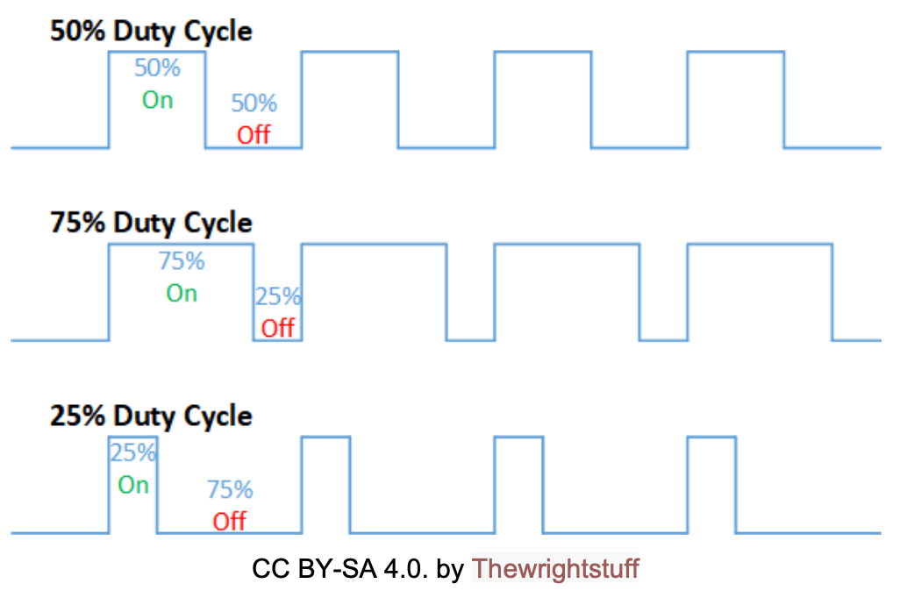

# servo motor control

**contents**
1.  [description](#description)
2.  [pwm and servo motor](pwn-and-servo-motor)
3.  [servo control programming](servo-control-programming)
4.  [submission](#submission)

## description

in this lab we will control a small servo motor using pwm.  in the case of an rc car, a servo motot is typically used to control the steering of the car.

## pwm and servo motor

pulse-width modulation (pwm) is a way to encode analog signals using digital outputs.  although a digital output can be either on or off at a time, by altering the durations of on and off, we can encode an arbitrary analog signal.  in a diagram below assume the `On` value is `5V`.  if the digital out is `On` for 50% of the duration its voltage is rated as 2.5V on average.  if the duty cycle is 75%, its voltage is 3.75V on average.  if the duty cycle is 25% its voltage is 1.25V on average.

owm has a wide variety of applications, one of which is servo motor control.  in this lab we use pwm to control a small servo motor see [microservo datasheet]("./PlatformIO/docs/sg90_microservo_datasheet.pdf")

a servo motot receives a pwm
