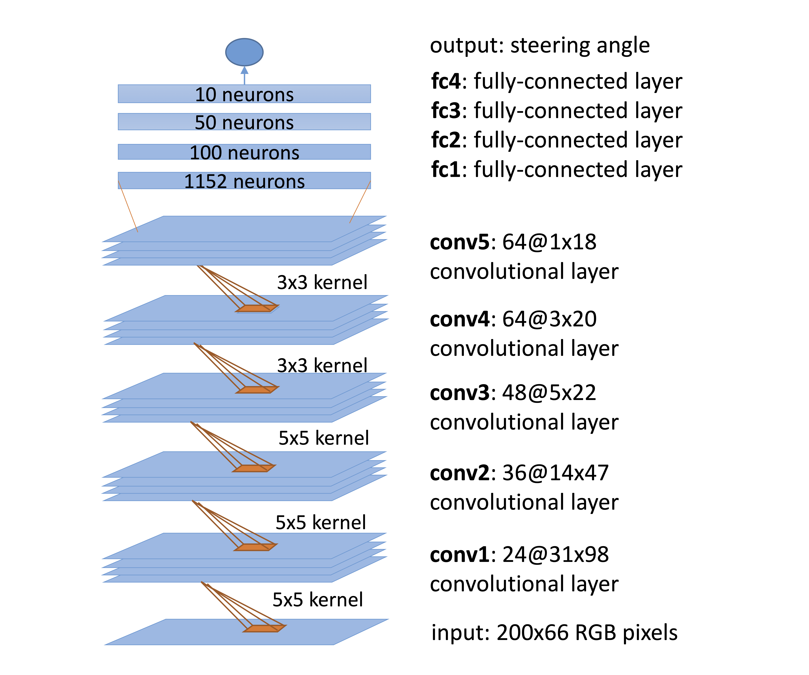
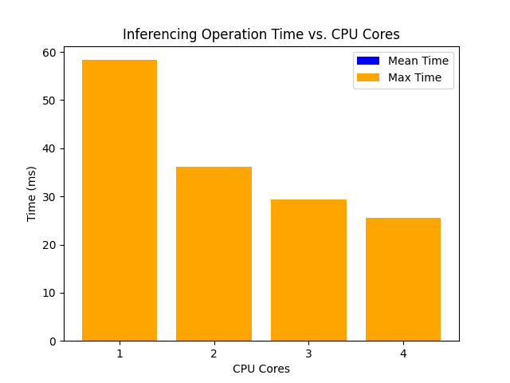

# real time dnn inferencing



morgan bergen

march 23 2023

### contents

1. [intro](#intro)
2. [tensorflow framework](#tensorflow-framework)
    1. [`dnn.py`](#dnnpy)
    2. [`model.py`](#modelpy)
3. [final task](#final-task)
    1. [conv1 convolutional layer completed inference](#conv1-convolutional-layer-completed-inference)
    2. [conv2 convolutional layer completed inference](#conv2-convolutional-layer-completed-inference)
    3. [conv3 convolutional layer completed inference](#conv3-convolutional-layer-completed-inference)
    4. [conv4 convolutional layer completed inference](#conv4-convolutional-layer-completed-inference)
4. [conclusion](#conclusion)
5. [references](#references)

## intro

DeepPicar is a "low-cost" deep nural network based autonomous car. this a mirrored small scale and stupid replication of a real self-driving car called [DAVE-2 by NVIDIA](https://developer.nvidia.com/blog/deep-learning-self-driving-cars/).  the objective is to load a machine learning algorithm load a [deep neural network](https://en.wikipedia.org/wiki/Deep_learning#Deep_neural_networks) **dnn** model and perform inferencing operations on the [rasberry pi 4](https://www.raspberrypi.com/documentation/).  note that all references will be dervied from [deeppicar project](https://github.com/dctian/DeepPiCar).

convolutional neural network CNN for short takes images front facing camera as input and produces car steering angles as output.  DeepPicar network architecture consists of - **9 layers - 27 million connections - 250k parameters** and can self drive in real-time using web camera and raspberry pi 3 quad-core platform.  using deeppicar we analyze the pi's computing capabilities to support end to end deep learning based real-time control of autonomous vehicles and look at the embedded computing platforms using DeepPicar cnn-based real time control workflow.

**directory tree**

```
❯ tree
.
├── dnn.py
├── epoch-1.avi
├── image.png
├── model
│   ├── model.ckpt.data-00000-of-00001
│   ├── model.ckpt.index
│   └── model.ckpt.meta
└── model.py

2 directories, 7 files
```

in the folder we already provided a pre-trained dnn model `model.py`, and `model/`, a sample video file `epoch-1.avi`, and inferference code `dnn.py`. the dnn model in `model.py` is designed to take a camera image as input and produce a steering angle to stay in the lane as output.  the sample video file was originally created from the camera of an rc car driven by a human pilot.  this video will be used as input to the dnn model instead of using an actual camera.  a series of frames will be individually analyzed and then will make an inference on what behavior is to take next.  if you wanted to make a self driving car using a camera system instead of radar expenses ratio is present, system will rely mostly on the camera and they run a suite of complex and sophisticated machine learning algoritms for each convolutional layer.

## tensorflow framework

### `dnn.py`

tensorflow a very popular deep learning framework developed by google is requisit to run a dnn based application.  in order to run a neural network tensorflow uses sessions which holds individual models and run the operations necessary for the network's architecture.  in order to load our dnn model, we need to create a session and assign the model to that session.

```python
# load the model
sess = tf.InteractiveSession(config = config) 
saver = tf.train.Saver()
model_load_path = "model/model.ckpt"
saver.restore(sess, model_load_path)
```

from there we can feed input data to the loaded model to perform [inferencing operations](https://www.intel.com/content/www/us/en/developer/videos/speed-scale-ai-inference-multiple-architectures.html) and get the control output.

```python
#!/usr/bin/env python
from __future__ import division

# Imports
import tensorflow as tf
model = __import__("model")
import cv2
import sys
import os
import time
import math
import numpy as np

# Radian <-> Degree conversion functions
def deg2rad(deg):
        return deg * math.pi / 180.0
def rad2deg(rad):
        return 180.0 * rad / math.pi

#Get and set the number of cores to be used by TensorFlow
if(len(sys.argv) > 1):
	NCPU = int(sys.argv[1])
else:
	NCPU = 1
config = tf.ConfigProto(intra_op_parallelism_threads=NCPU, \
                        inter_op_parallelism_threads=NCPU, \
                        allow_soft_placement=True, \
                        device_count = {'CPU': 1})

#The max number of frames to be processed,
#    and the number of frames already processed
NFRAMES = 1000
curFrame = 0

#Periodic task options
period = 50
is_periodic = True

# load the model
sess = tf.InteractiveSession(config=config)
saver = tf.train.Saver()
model_load_path = "model/model.ckpt"
saver.restore(sess, model_load_path)

#Create lists for tracking operation timings
cap_time_list = []
prep_time_list = []
pred_time_list = []
tot_time_list = []

print('---------- Processing video for epoch 1 ----------')

#Open the video file
vid_path = 'epoch-1.avi'
assert os.path.isfile(vid_path)
cap = cv2.VideoCapture(vid_path)

#Process the video while recording the operation execution times
print('performing inference...')
time_start = time.time()
first_frame = True
while(1):
	if curFrame < NFRAMES:
		cam_start = time.time()

		#Get the next video frame
		ret, img = cap.read()
		if not ret:
			break

		prep_start = time.time()

		#Preprocess the input frame
		img = cv2.resize(img, (200, 66))
		img = img / 255.

		pred_start = time.time()

		#Feed the frame to the model and get the control output
		rad = model.y.eval(feed_dict={model.x: [img]})[0][0]
		deg = rad2deg(rad)
		pred_end   = time.time()

		#Calculate the timings for each step
		cam_time  = (prep_start - cam_start)*1000
		prep_time = (pred_start - prep_start)*1000
		pred_time = (pred_end - pred_start)*1000
		tot_time  = (pred_end - cam_start)*1000

		print('pred: {:0.2f} deg. took: {:0.2f} ms | cam={:0.2f} prep={:0.2f} pred={:0.2f}'.format(deg, tot_time, cam_time, prep_time, pred_time))

		#Don't include the timings for the first frame due to cache warmup
		if first_frame:
			first_frame = False
		else:
			tot_time_list.append(tot_time)
			curFrame += 1

		#Wait for next period
		wait_time = (period - tot_time) / 1000
		if is_periodic and wait_time > 0:
			time.sleep(wait_time)
	else:
		break

cap.release()

#Calculate and output FPS/frequency
fps = curFrame / (time.time() - time_start)
print('completed inference, total frames: {}, average fps: {} Hz'.format(curFrame+1, round(fps, 1)))

#Calculate and display statistics of the total inferencing times
print("count: {}".format(len(tot_time_list)))
print("mean: {}".format(np.mean(tot_time_list)))
print("max: {}".format(np.max(tot_time_list)))
print("99.999pct: {}".format(np.percentile(tot_time_list, 99.999)))
print("99.99pct: {}".format(np.percentile(tot_time_list, 99.99)))
print("99.9pct: {}".format(np.percentile(tot_time_list, 99.9)))
print("99pct: {}".format(np.percentile(tot_time_list, 99)))
print("min: {}".format(np.min(tot_time_list)))
print("median: {}".format(np.median(tot_time_list)))
print("stdev: {}".format(np.std(tot_time_list)))
```

### `model.py`

```python
#!/usr/bin/env python

from __future__ import division

import tensorflow as tf

def weight_variable(name, shape):
    return tf.get_variable(name, shape=shape, initializer=tf.contrib.layers.xavier_initializer())

def bias_variable(shape):
    initial = tf.constant(0.1, shape=shape)
    return tf.Variable(initial)

def conv2d(x, W, stride):
    return tf.nn.conv2d(x, W, strides=[1, stride, stride, 1], padding='VALID')

x = tf.placeholder(tf.float32, shape=[None, 66, 200, 3], name="input_x")
y_ = tf.placeholder(tf.float32, shape=[None, 1])

x_image = x

# first convolutional layer
W_conv1 = weight_variable("wc1", [5, 5, 3, 24])
b_conv1 = bias_variable([24])

h_conv1 = tf.nn.relu(conv2d(x_image, W_conv1, 2) + b_conv1, name="relu1")

# second convolutional layer
W_conv2 = weight_variable("wc2", [5, 5, 24, 36])
b_conv2 = bias_variable([36])

h_conv2 = tf.nn.relu(conv2d(h_conv1, W_conv2, 2) + b_conv2, name="relu2")

# third convolutional layer
W_conv3 = weight_variable("wc3", [5, 5, 36, 48])
b_conv3 = bias_variable([48])

h_conv3 = tf.nn.relu(conv2d(h_conv2, W_conv3, 2) + b_conv3, name="relu3")

# fourth convolutional layer
W_conv4 = weight_variable("wc4", [3, 3, 48, 64])
b_conv4 = bias_variable([64])

h_conv4 = tf.nn.relu(conv2d(h_conv3, W_conv4, 1) + b_conv4, name="relu4")

# fifth convolutional layer
W_conv5 = weight_variable("wc5", [3, 3, 64, 64])
b_conv5 = bias_variable([64])

h_conv5 = tf.nn.relu(conv2d(h_conv4, W_conv5, 1) + b_conv5, name="relu5")
h_conv5_flat = tf.reshape(h_conv5, [-1, 1152], name="reshape1")

# fully connected layer 2
W_fc2 = weight_variable("fc2", [1152, 100])
b_fc2 = bias_variable([100])

h_fc2 = tf.nn.relu(tf.matmul(h_conv5_flat, W_fc2, name="matmul1") + b_fc2, name="relu6")

# fully connected layer 3
W_fc3 = weight_variable("fc3", [100, 50])
b_fc3 = bias_variable([50])

h_fc3 = tf.nn.relu(tf.matmul(h_fc2, W_fc3, name="matmul2") + b_fc3, name="relu7")

# fully connected layer 4
W_fc4 = weight_variable("fc4", [50, 10])
b_fc4 = bias_variable([10])

h_fc4 = tf.nn.relu(tf.matmul(h_fc3, W_fc4, name="matmul3") + b_fc4, name="relu8")

# output
W_fc5 = weight_variable("fc5", [10, 1])
b_fc5 = bias_variable([1])

y = tf.multiply(tf.atan(tf.matmul(h_fc4, W_fc5, name="matmul4") + b_fc5), 2, name="atan1") 
#scale the atan output
```


## final task

run the DNN inference code for CPU core numbers 1, 2 , 3 and 4.
Your task is to measure the performance---especially mean, which represents the average, and max, which represents the worst-case---of the inferencing operations while varying the number of CPU cores being used from 1 to 4.  Prepare a table showing the CPU core numbers, the mean and max time of inferencing operations (shown below) and write a comment on the result. (for example: how the inferencing operation time is varying with the CPU core, you can show your result using a graph as well.)


### conv1 convolutional layer completed inference

```
---------- Processing video for epoch 1 ----------
performing inference...
pred: -6.98 deg. took: 50.31 ms | cam=7.29 prep=2.94 pred=40.08
pred: -7.25 deg. took: 25.42 ms | cam=0.66 prep=1.17 pred=23.58
...
pred: -29.11 deg. took: 24.71 ms | cam=0.67 prep=1.09 pred=22.96
pred: -22.35 deg. took: 24.62 ms | cam=0.64 prep=1.08 pred=22.90
completed inference, total frames: 1000, average fps: 19.3 Hz
count: 999
mean: 26.2203142569
max: 58.3357810974
99.999pct: 58.1613650417
99.99pct: 56.5916205406
99.9pct: 40.8941755295
99pct: 37.037358284
min: 24.570941925
median: 24.8510837555
stdev: 3.47506702438
```
### conv2 convolutional layer completed inference

```
---------- Processing video for epoch 1 ----------
performing inference...
pred: -6.98 deg. took: 45.26 ms | cam=7.29 prep=2.89 pred=35.08
pred: -7.25 deg. took: 20.32 ms | cam=0.66 prep=1.15 pred=18.50
...
pred: -29.11 deg. took: 28.65 ms | cam=0.92 prep=1.60 pred=26.14
pred: -22.35 deg. took: 27.23 ms | cam=0.90 prep=1.60 pred=24.73
completed inference, total frames: 1000, average fps: 19.9 Hz
count: 999
mean: 26.8364902493
max: 36.1139774323
99.999pct: 36.1094850922
99.99pct: 36.0690540314
99.9pct: 35.6647434235
99pct: 33.7034082413
min: 19.3250179291
median: 27.5340080261
stdev: 3.79996037867
```

### conv3 convolutional layer completed inference

```
---------- Processing video for epoch 1 ----------
performing inference...
pred: -6.98 deg. took: 41.64 ms | cam=7.03 prep=2.98 pred=31.64
pred: -7.25 deg. took: 17.19 ms | cam=0.67 prep=1.14 pred=15.38
...
pred: -29.11 deg. took: 24.36 ms | cam=0.87 prep=1.82 pred=21.67
pred: -22.35 deg. took: 24.37 ms | cam=0.96 prep=1.80 pred=21.60
completed inference, total frames: 1000, average fps: 19.9 Hz
count: 999
mean: 23.2169482562
max: 29.3099880219
99.999pct: 29.3095311737
99.99pct: 29.3054195404
99.9pct: 29.2643032074
99pct: 25.9509801865
min: 15.9211158752
median: 22.5110054016
stdev: 1.37844835858

```

### conv4 convolutional layer completed inference

```
---------- Processing video for epoch 1 ----------
performing inference...
pred: -6.98 deg. took: 41.64 ms | cam=7.03 prep=2.98 pred=31.64
pred: -7.25 deg. took: 17.19 ms | cam=0.67 prep=1.14 pred=15.38
...
pred: -29.11 deg. took: 21.31 ms | cam=0.98 prep=1.77 pred=18.56
pred: -22.35 deg. took: 20.01 ms | cam=0.97 prep=1.76 pred=17.28
completed inference, total frames: 1000, average fps: 19.9 Hz
count: 999
mean: 21.1903220779
max: 25.6199836731
99.999pct: 25.6160219431
99.99pct: 25.5803663731
99.9pct: 25.2238106728
99pct: 24.5365142822
min: 14.2619609833
median: 21.3599205017
stdev: 1.17142166239
```

| cpu core |   meantime    |     maxtime   |
|:--------:|:-------------:|:-------------:|
| conv1    | 24.570941925  | 58.3357810974 |
| conv2    | 19.3250179291 | 36.1139774323 |
| conv3    | 15.9211158752 | 29.3099880219 |
| conv4    | 14.2619609833 | 25.6199836731 |

## conclusion

based on emperical analysis of running all cores we can observe that as the number of cpu cores in increased from 1 to 4, the mean and max times of inferencing operations for each convolutional layer decreases.  this indicates that increasing the number of cpu cores results in faster execution of the inferencing operations.  

the difference between the time for using 1 and 2 cores is higher for the conv1 layer compared to the other layers, indicating that this layer is more computationally intensive than the others.  

the time difference between 2 to 3 cores and 3 to 4 cores are relatively small for all layers, suggesting that further increasing the number of cores may not provide a significant improvement in performance.  however, this can only be confirmed by testing with a higher `N` of cores.



## references

* [tensorflow](https://www.tensorflow.org/)
* [keras](https://keras.io/)
* [opencv](https://opencv.org/)
* [python](https://www.python.org/)
* [numpy](https://numpy.org/)
* [matplotlib](https://matplotlib.org/)
* [pandas](https://pandas.pydata.org/)
