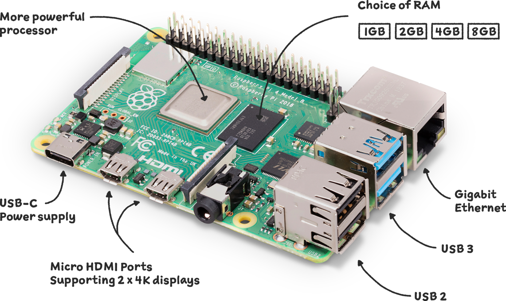
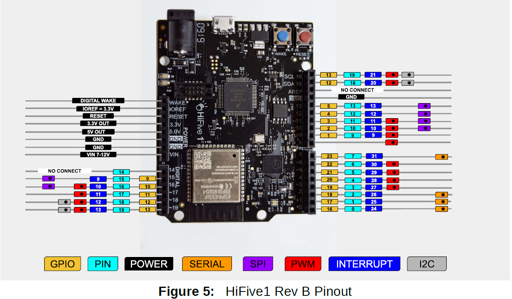
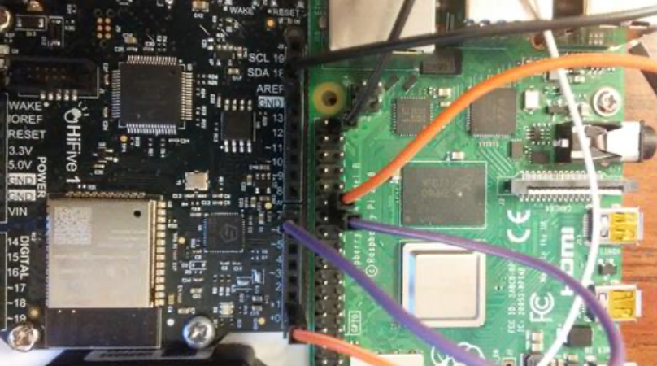

# board to board communication

### contents 

1.  [objective](#objective)
2.  [uart connections](#uart-connections)
3.  [programming the hifive](#programming-the-hifive)
4.  [evaluation](#evaluation)
5.  [references](#references)


### directory tree

```
❯ tree
.
├── docs
│   ├── 14588-TFMini_-_Micro_Infrared_Module-03_Pinout_small.png
│   ├── FE310-G002.pdf
│   ├── benewake-tfmini-datasheet.pdf
│   ├── hifive1-revb-pinout.png │   └── hifive1b-getting-started-guide_v1.1.pdf
├── include
│   └── README
├── lib
│   └── README
├── platformio.ini
├── src
│   ├── comm.c
│   ├── eecs388_lib.c
│   └── eecs388_lib.h
└── test
    └── README

6 directories, 12 files
```

##  objective

the purpose of this src is to establish uart based communication channels between the pi 4 and the hifive1 board.  





##  uart connection

in this section we will connect the hifive1 and the rasberry pi 4 boards via two uart channels.  while the pi 4 has 4 uarts we will only be using two of them today `uart2` and `uart3`.  examine the file `/boot/config.txt` for the following two lines enabling `uart2` and `uart3`, and them to file if they are not present.  

```
dtoverlay=uart2,115200
dtroverlay=uart3,115200
```

if you needed to add these two lines, reboot the rasberry pi.  after rebooting the system, `/dev/ttyAMA1` and `/dev/ttyAMA2` will be created.  



connect hifive's `uart1 rx` `pin7` to raspberry pi 4's `uart2 tx` `pin27`.  this is the main communication line between the pi 4 and the hifive1.  from the pi4 you can access the channel via `/dev/ttyAMA1`.  for debugging of hifive1, connect hifive's `uart0 tx` (`pin1`) to pi 4's `uart3 rx` (`pin29`) from the pi4, it can also be accessed via `/dev/ttyAMA2`.  in summary, you will be able to access the following two files from the pi 4.  

```
/dev/ttyAMA1    pi 4 -> hfive1:  send steering angle to hifive1 (uart1)
/dev/ttyAMA2    hifive1 -> pi 4: receive hifive1 console (uart0) output
```

##  programming the hifive1

in this part of the lab, you will program the hifive1 to receive data from the pi4.  your task is to receive the data from hifive1's `uart1` channel and send the receive data to `uart0` channel as a **null-terminated string**.  the following is a rough **pseudo code** for the task.

```c
while(1) {
    if (is uart1 ready?) {
        data = read from uart1
        print data to uart0
    }
}
```

in order to implement the task you should use the provided serial api shown in the following.  note that `devid` is `0` to access `uart0`, while it is `1` to access `uart1`.  for this src the two functions `ser_printline` and `ser_readline` will be especially helpful, since you need to send the data as a string.

```c
void ser_setup(int devid);
int ser_isready(int devid);
void ser_write(int devid, char c);
void ser_printline(int devid, char *str);
char ser_read(int devid);
int ser_readline(int devid, int n, char *str);
```

in particular you may need to use `ser_isready()` function to check whether a given `uart` channel has pending data to read.  to better understand what a specific function is doing you can always check both the `eecs388_lib.h` and `eecs388_lib.c` modules in order to properly call these functions.

```c
int ser_isready(int devid) {
    uint32_t regval = *(volatile uint32_t *)(UART_ADDR(devid) + UART_IP);
    return(regval);
}
```

**how to test your hifive code** once you finish programming the hifive1, **switch to the raspberry pi4** and open two terminals:  one for sending data to the hifive1, and one for seeing the debug message output from the hifive1.

**sender's terminal (terminal 1):**
```
$ screen /dev/ttyAMA1 115200
```
**debugg terminal (terminal 2):**
```
$ screen /dev/ttyAMA2 115100
```

now type any string on the 'terminal 1'.  if you programmed your hifive1 correct, you should see the message coming out from the 'terminal 2' terminal.  if you see an error message like "screen is terminating", you should kill the terminals and then again re-open the terminal.

## evaluation

show your work to the ta for demo, submit your modified c code file (hifive part) on canvas, you only need to submit the `eecs388_interrupt.c` module.

##  references

-  [documentation for PIO unit testing](https://docs.platformio.org/en/latest/advanced/unit-testing/index.html)

##  `comm.c` / `eecs388_interrupt.c`

```c
#include <stdint.h>
#include <stdio.h>
#include <string.h>

#include "eecs388_lib.h"

int main() {
    // initialize UART channels
    ser_setup(0); // uart0 (debug)
    ser_setup(1); // uart1 (raspberry pi)
    
    printf("Setup completed.\n");
    printf("Begin the main loop.\n");
    
    /*
     while (1) {
        if (ser_isready(1)) { // if UART1 is ready to receive data
            char str[80];
            ser_readline(1, 80, str); // read from UART1
            ser_printline(0, str); // print to UART0 (debug)
        }
    }
    */

    while (1) {
        if (ser_isready(1)) {
            char str[80];
            ser_readline(1, 80, str);
            ser_printline(0, str);
        }
    }
    return 0;
}
```

##  `eecs388_lib.c`

```c
#include <stdint.h>
#include "eecs388_lib.h"

char __buf[80];

void gpio_mode(int gpio, int mode)
{
  uint32_t val;
  
  if (mode == OUTPUT) {
    val = *(volatile uint32_t *) (GPIO_CTRL_ADDR + GPIO_OUTPUT_EN);
    val |= (1<<gpio);
    *(volatile uint32_t *) (GPIO_CTRL_ADDR + GPIO_OUTPUT_EN) = val;

    if (gpio == RED_LED || gpio == GREEN_LED || gpio == BLUE_LED) {
      // active high
      val = *(volatile uint32_t *) (GPIO_CTRL_ADDR + GPIO_OUTPUT_XOR);
      val |= (1<<gpio);
      *(volatile uint32_t *) (GPIO_CTRL_ADDR + GPIO_OUTPUT_XOR) = val;
    }
  } else if (mode == INPUT) {`
    val = *(volatile uint32_t *) (GPIO_CTRL_ADDR + GPIO_INPUT_EN);
    val |= (1<<gpio);
    *(volatile uint32_t *) (GPIO_CTRL_ADDR + GPIO_INPUT_EN) = val;
  }
  return;
}

void gpio_write(int gpio, int state)
{
  uint32_t val = *(volatile uint32_t *) (GPIO_CTRL_ADDR + GPIO_OUTPUT_VAL);
  if (state == ON) 
    val |= (1<<gpio);
  else
    val &= (~(1<<gpio));    
  *(volatile uint32_t *) (GPIO_CTRL_ADDR + GPIO_OUTPUT_VAL) = val;
  return;
}

void set_cycles(uint64_t cycle)
{
  *(volatile uint64_t *)(CLINT_CTRL_ADDR + CLINT_MTIMECMP) = cycle;
}

uint64_t get_cycles(void)
{
  return *(volatile uint64_t *)(CLINT_CTRL_ADDR + CLINT_MTIME);
}

void delay(int msec)
{
  uint64_t tend; 
  tend = get_cycles() + msec * 32768 / 1000;
  while (get_cycles() < tend) {}; 
}

void delay_usec(int usec)
{
  uint64_t tend; 
  tend = get_cycles() + (uint64_t)usec * 32768 / 1000000;
  while (get_cycles() < tend) {}; 
}

void (*interrupt_handler[MAX_INTERRUPTS])();
void (*exception_handler[MAX_INTERRUPTS])();
void (*plic_handler[MAX_EXT_INTERRUPTS])();
volatile int intr_count;

void handle_trap(void) __attribute((interrupt));
void handle_trap()
{  
    unsigned long mcause = read_csr(mcause);
    if (mcause & MCAUSE_INT) {
        printf("interrupt. cause=%d, count=%d\n", 
            (int)(mcause & MCAUSE_CAUSE), (int)intr_count++);
        // mask interrupt bit and branch to handler
        interrupt_handler[mcause & MCAUSE_CAUSE] ();
    } else {
        printf("exception=%d\n", (int)(mcause & MCAUSE_CAUSE));
        // synchronous exception, branch to handler
        exception_handler[mcause & MCAUSE_CAUSE]();
    }
}

void extint_handler()
{
    //get the highest priority pending PLIC interrupt
    uint32_t int_num = *(volatile uint32_t *)PLIC_CLAIM_ADDR;
    //branch to handler
    printf("External interrupt %d occured\n", (int)int_num);
    plic_handler[int_num]();
    //complete interrupt by writing interrupt number back to PLIC
    *(volatile uint32_t *)PLIC_CLAIM_ADDR = int_num;
}
void enable_timer_interrupt()
{
    write_csr(mie, read_csr(mie) | (1 << MIE_MTIE_BIT));
}

void enable_external_interrupt()
{
    write_csr(mie, read_csr(mie) | (1 << MIE_MEIE_BIT));
}

void enable_interrupt()
{
    write_csr(mstatus, read_csr(mstatus) | (1 << MSTATUS_MIE_BIT));
}

void disable_interrupt()
{
    write_csr(mstatus, read_csr(mstatus) & (~(1 << MSTATUS_MIE_BIT)));
}

void register_trap_handler(void *func)
{
    write_csr(mtvec, ((unsigned long)func));
}

void ser_setup(int devid)
{
  /* initialize UART0 TX/RX */
  *(volatile uint32_t *)(UART_ADDR(devid) + UART_TXCTRL) |= 0x1;
  *(volatile uint32_t *)(UART_ADDR(devid) + UART_RXCTRL) |= 0x1;

  *(volatile uint32_t *)(UART_ADDR(devid) + UART_IE) |= 0x3; /* UART interrupt enable */
  *(volatile uint32_t *)(UART_ADDR(devid) + UART_DIV) = 139; /* baudrate ~115200 bps */

  /* enable UART1 IOF */
  *(volatile uint32_t *)(GPIO_CTRL_ADDR + GPIO_IO_FUNC_EN) |= 0x840000;  
}

int  ser_isready(int devid)
{
  uint32_t regval = *(volatile uint32_t *)(UART_ADDR(devid) + UART_IP);
  return regval;
}

void ser_write(int devid, char c)
{
  uint32_t regval;
  /* busy-wait if tx FIFO is full  */
  do {
    regval = *(volatile uint32_t *)(UART_ADDR(devid) + UART_TXDATA);
  } while (regval & 0x80000000);

  /* write the character */
  *(volatile uint32_t *)(UART_ADDR(devid) + UART_TXDATA) = c;
}

void ser_printline(int devid, char *str)
{
  int i;
  for (i = 0;; i++) {
    if (str[i] == '\n') {
      ser_write(devid, '\r');
      ser_write(devid, '\n');
    } else if (str[i] == '\0') {
      break;
    } else {
      ser_write(devid, str[i]);
    }
  }
}

char ser_read(int devid)
{
  uint32_t regval;
  /* busy-wait if receive FIFO is empty  */
  do {
    regval = *(volatile uint32_t *)(UART_ADDR(devid) + UART_RXDATA);
  } while (regval & 0x80000000);
  /* return a byte */
  return (uint8_t)(regval & 0xFF);
}

int ser_readline(int devid, int n, char *str)
{
  int i = 0; 
  for (i = 0; i < n; i++) {
#if 0     
    if (!ser_isready(devid)) {// non-blocking io
      str[i] = 0;
      return i;
    }
#endif
    str[i] = ser_read(devid);
    ser_write(0, str[i]);
    if (str[i] == '\r' || str[i] == '\n') {
      str[i] = 0;
      return i;      
    } 
  }
  str[i-1] = 0;
  return i; 
}
```

##  `eecs388_lib.h`

```c
#ifndef __EECS388_LIB_H__
#define __EECS388_LIB_H__

#include <stdio.h>

/******************************************************************************
 *   generic definitions
 *******************************************************************************/
#define ON                  1
#define OFF                 0
#define OUTPUT              1
#define INPUT               0

/******************************************************************************
 *   hifive1 platform related definitions
 *******************************************************************************/
#define RED_LED             22 // gpio 22
#define BLUE_LED            21 // gpio 21
#define GREEN_LED           19 // gpio 19

#define PIN_19              13 // gpio 13

#define MAX_INTERRUPTS      16
#define MAX_EXT_INTERRUPTS  52

/******************************************************************************
 *   memory map
 *******************************************************************************/
#define GPIO_CTRL_ADDR      0x10012000  // GPIO controller base address
#define GPIO_INPUT_VAL      0x00        // input val
#define GPIO_INPUT_EN       0x04        // input enable
#define GPIO_OUTPUT_EN      0x08        // output enable
#define GPIO_OUTPUT_VAL     0x0C        // output_val 
#define GPIO_IO_FUNC_EN     0x38        // gpio iof enable.
#define GPIO_OUTPUT_XOR     0x40        // output XOR (invert)

#define CLINT_CTRL_ADDR     0x02000000  // CLINT controller base address
#define CLINT_MTIME         0xbff8      // timer register
#define CLINT_MTIMECMP      0x4000      // timer compare register

#define UART0_CTRL_ADDR     0x10013000  // UART0 controller base address 
#define UART1_CTRL_ADDR     0x10023000  // UART1 controller base address
#define UART_TXDATA         0x00        // TXFIFO register
#define UART_RXDATA         0x04        // RXFIFO register
#define UART_TXCTRL         0x08        // TX control register
#define UART_RXCTRL         0x0C        // RX control register
#define UART_IE             0x10        // interrupt enable register
#define UART_IP             0x14        // interrupt pending register
#define UART_DIV            0x18        // uart baud rate divisor

#define MCAUSE_INT          0x80000000UL
#define MCAUSE_CAUSE        0x000003FFUL
#define MSTATUS_MIE_BIT     (3)  // global interrupt enable bit mask. 
#define MIE_MTIE_BIT        (7)  // machine mode timer interrupt enable bit mask. 
#define MIE_MEIE_BIT        (11) // machine mode external interrupt enable bit mask. 

#define PLIC_CLAIM_ADDR     0x0C200004  // PLIC claim/complete register
/******************************************************************************
 *   macros
 *******************************************************************************/
#define read_csr(reg) ({ unsigned long __tmp; \
  asm volatile ("csrr %0, " #reg : "=r"(__tmp)); \
  __tmp; })

#define write_csr(reg, val) ({ \
  asm volatile ("csrw " #reg ", %0" :: "rK"(val)); })

#define UART_ADDR(devid) (UART0_CTRL_ADDR + devid * 0x10000)

#define printf(x...) {sprintf(__buf, x); ser_printline(0, __buf);}
 
/******************************************************************************
 *   eecs388 library api (similar to Arduino)
 *******************************************************************************/
extern char __buf[80];

void gpio_mode(int gpio, int mode);
void gpio_write(int gpio, int state);

void set_cycles(uint64_t cycle);
uint64_t get_cycles(void);

void delay(int msec);
void delay_usec(int usec);

void enable_timer_interrupt();
void enable_external_interrupt();
void enable_interrupt();
void disable_interrupt();
void register_trap_handler(void *func);

void ser_setup(int devid);
int  ser_isready(int devid);
void ser_write(int devid, char c);
void ser_printline(int devid, char *str);
char ser_read(int devid);
int ser_readline(int devid, int n, char *str);
#endif // __EECS388_LIB_H__
```

##  `boot`

lab8@EECS388rpi15:/ $ cd boot
lab8@EECS388rpi15:/boot $ ls
bcm2708-rpi-b.dtb         bcm2711-rpi-cm4.dtb  kernel7l.img
bcm2708-rpi-b-plus.dtb    bootcode.bin         kernel8.img
bcm2708-rpi-b-rev1.dtb    cmdline.txt          kernel.img
bcm2708-rpi-cm.dtb        config.txt           LICENCE.broadcom
bcm2708-rpi-zero.dtb      COPYING.linux        os_config.json
bcm2708-rpi-zero-w.dtb    fixup4cd.dat         overlays
bcm2709-rpi-2-b.dtb       fixup4.dat           start4cd.elf
bcm2710-rpi-2-b.dtb       fixup4db.dat         start4db.elf
bcm2710-rpi-3-b.dtb       fixup4x.dat          start4.elf
bcm2710-rpi-3-b-plus.dtb  fixup_cd.dat         start4x.elf
bcm2710-rpi-cm3.dtb       fixup.dat            start_cd.elf
bcm2710-rpi-zero-2.dtb    fixup_db.dat         start_db.elf
bcm2710-rpi-zero-2-w.dtb  fixup_x.dat          start.elf
bcm2711-rpi-400.dtb       issue.txt            start_x.elf
bcm2711-rpi-4-b.dtb       kernel7.img


