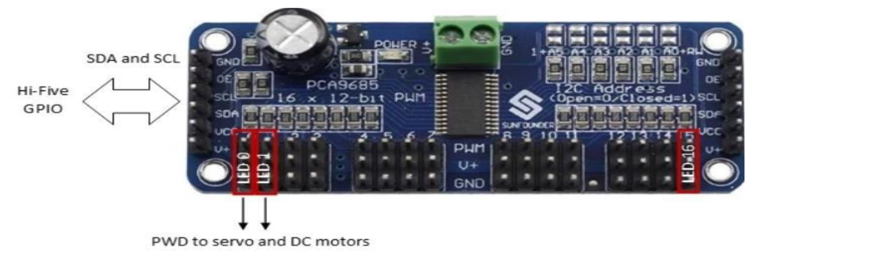
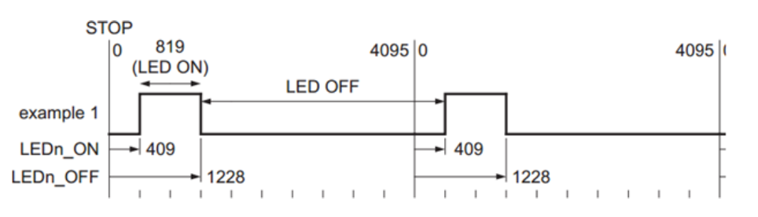
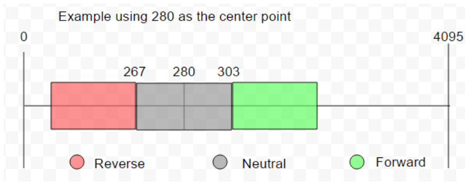

#  milestone

teammates

1. [Morgan Maha Bergen](https://github.com/MorganBergen)
2. [Saje Ein Cowell](https://github.com/sajeyyy)
3. [Collins Gatimi](https://github.com/Gatimio)
4. [Charlie Gillund](https://github.com/ChuckGills)


###  contents

1.  [tree](#tree)
2.  [intro](#intro)
3.  [milestone 01](#milestone-01)
4.  [**part 01** setting up the i2c via the metal library](#part-1-setting-up-the-i2c-via-the-metal-library)
5.  [**part 02** configuring the pca9685](#part-02-configuring-the-pca9685)
6.  [**part 03** using the transfer method to control the pca9695 servo control](#part-03-using-the-transfer-method-to-control-the-pca9695-servo-control)
7.  [**task 01** the breakup function](#task-01-the-breakup-function) `breakup()` 
8.  [**task 02** the streering function](#task-02-the-steering-function) `steering()`
9.  [**part 04** using the transfer methdo to control the pca9695 motor control](#part-04-using-the-transfer-methdo-to-control-the-pca9695-motor-control)
10. [**task 03** calibrating and defining the top stop function](#task-03-calibrating-and-defining-the-top-stop-function) `stopMotor()`
11. [**task 04** drive forward function](#task-04-drive-forward-function) `driveForward()` 
12. [**task 05** drive reverse function](#task-05-drive-reverse-function) `driveReverse()` 
13. [**task 06** fully controlling the pca9685](#task-06-fully-controlling-the-pca9685) `main()`


```
❯ tree
.
├── docs
│   ├── FE310-G002.pdf
│   ├── hifive1-revb-pinout.png
│   ├── hifive1b-getting-started-guide_v1.1.pdf
│   └── sg90_microservo_datasheet.pdf
├── include
│   └── README
├── lib
│   └── README
├── platformio.ini
├── src
│   ├── eecs388_i2c.c
│   ├── eecs388_lib.c
│   └── eecs388_lib.h
└── test
    └── README

6 directories, 11 files
```

##  intro

this src will implement an rc car's components by incorporating elements from the previous labs.  this project with necessitation using a new board `pca9695` for driving servo and dc motors.  `pca9695` users `i2c` to receive commands from hi-five board to generate pwm signal for the servo and dc motors.  the final project weighs `15%` of your total course grade.

the car prototype that you are going to use has seven main components

1.  hi-five board
2.  pi board
3.  motot driver `pca9695` 4-lidar
4.  dc motot
5.  servo motot
6.  electronic speed controller (ecs)

your goal in this project is to first use the hi-five board to send i2c commands to `pca9695` to drive the servo motot (for streering) and dc motots (for moving forward and backwards) (milestone 1).  then connect pi to hi-five board using `uart`.  this is to set up a connection between the two boards for sending steering commands from the pi to the hi-five board (milestone 2).  lastly, you are going to control the car using a sequence of commands sending the streering commands from the pi to the hi-five board using `uart` and then to the motors using `pwm` i1c controller (milestone 3).

the project must have a group of 4 individuals

##  milestone 01

in this section you will configure the pwn controller and use the hi-five board to dive the servo and dc motor.  your `milestone-1` source code [`milstone1.tar.gz`](./tarred/milestone1.tar.gz) is uploaded.  download and import into platformio on vscode like you did for your previous labs.

you need to complete the 6 tasks highlighted in green color to finish milestone 1.  in order to accomplish this streering and motor contro, the system will require stronger servos than previously used in the lab and subsequently needs an external power supply along with a dedicated servo driver.  the `pca9685` is a 16 channel 12-bit `pwn` servo driver which uses the `ica` serial communication protocol.  in `pca9685` nomenclature, the output channels are called led channels (because one of the main use-cases of the board is to drive `leds`.  we use channel `0` and channel `1` (i.e. `LED0` and `LED1`) for driving servo motor and dc motor, respectively.



you do not need to know the low-level operation of the `i2c` protocol to finish this milestone.  instead you are going to use ready-to-use libraries to communicate over ther `i2c` interface.  on the hifive board, the `i2c` core is from a 3rd party provider called [opencores](https://opencores.org/projects/i2c) the framework used by hifive, freedom-e-sdk or metal library includes an i2c library under the metal folder.

first, in the `c_cpp_properties.json` contained in the `.vscode` folder, confirm if your included path contains the following line:

`[user specific info]/.platformio/packages/framework-freedom-e-sdk/freedom-metal"`

this line adds the metal library to your include path - allowing you to easily include the metal library into your code by simply adding this line to the top of your code (line 4 of [`milestone1/src/eecs388_i2c.c`](./milestone1/src/eecs388_i2c.c)

`#include "metal/i2c.h"`

##  **part 01** setting up the i2c via the metal library

the metal library requires three key elements to function properly, a pointer to its instance and two `u_int8` arrays, which will be used in the reading and writing data.  while the length of the read array only needs to be 1, the length of the write array should be 5.  the following code accomplished this in lines 7 - 9 of [`milestone1/src/eecs388_i2c.c`](./milestone1/src/eecs388_i2c.c)

```c
struct metal_i2c *i2c;
uint8_t bufWrite[9];
uint8_t bufRead[1];
```

the following line initializes the i2c device number 0 and get a handle of the device and assigns it to the `metal_i2c` pointer struct on line 18 

```c
i2c = metal_i2c_get_device(0);
```

if `i2c == NULL;` then the connection to the i2c device the pca9685 was unsuccessful on line 20.  finally we need to initialize the i2c module in the hifive board as the master with the following line.  we are using a baud rate of 100000: line 26.

```
metal_i2c_init(i2c,I2C_BAUDRATE,METAL_I2C_MASTER);
```

this concludes the i2c setup.  from here, we will use the write and transfer methods to write/read pca6985 registers.  however, first we must configure pca9685 board with a few key configurations; otherwise the driver will not work.

##  **part 02** configuring the pca9685

according to the datasheet found [here](http://wiki.sunfounder.cc/images/e/ea/PCA9685_datasheet.pdf) the base memory mapped address for a single pca9685 is `0x40`.  for ease of use, we already defined these to your released lines 54 - 64 [`eecs388_lib.h`](./milestone1/src/eecs388_lib.h).  

```c
//Setup for PCA9685
#define PCA9685_I2C_ADDRESS 0x40
#define PCA9685_MODE1 0x00              /**< Mode Register 1 */
#define PCA9685_LED0_ON_L 0x06          /**< LED0 on tick, low byte*/
#define PCA9685_PRESCALE 0xFE           /**< Prescaler for PWM output frequency */

// MODE1 bits
#define MODE1_SLEEP 0x10                /**< Low power mode. Oscillator off */
#define MODE1_AI 0x20                   /**< Auto-Increment enabled */
#define MODE1_RESTART 0x80              /**< Restart enabled */
#define FREQUENCY_OSCILLATOR 25000000   /**< Int. osc. frequency in datasheet */
```

we will begin by writing a reset command to the mode1 register.  the parameters of the write functions are as follows

```c
/* 
 * @brief perform a i2c write
 * @param i2c the handle for the i2c device to perform the write operation
 * @param addr the i2c slave address for the write operation
 * @param len the number of bytes to transfer
 * @param buf the buffer to send over the i2c bus.  must be len bytes long
 * @param stop_bit enable / disable stop condition
 * return 0 if the write succeeds
 */

 inline int metal_i2c_write(struct metal_i2c *i2c, 
                            unsigned int addr,
                            unsigned int len,
                            unsigned char buf[],
                            metal_i2c_top_bit_t stop_bit) {
    return(i2c -> vtable -> write(i2c, addr, len, buf, stop_bit);
}
```

we start by writing a reset command to the pca9695, which looks like the following.  the final parameter for writing is either `METAL_I2C_STOP_DISABLE` or `METAL_I2C_STOP_ENABLE`. it is a value defined that sets the stop condition in the i2c protocol.  if you ever send a single write or read command to the `pca9685` you will use `METAL_I2C_STOP_DISABLE` as the last parameter if you plan to do multiple sequential writes/reads.  you should make sure that the final write/read has the stop condition as `METAL_I2C_STOP_ENABLE` lines 28 - 32 of [`eecs388_i2c.c`](./milestone1/src/eecs388_i2c.c)

```c
bufWrite[0] = PCA9685_MODE1;
bufWrite[1] = MODE1_RESTART;
success metal_i2c_write(i2c, PCA9685_I2C_ADDRESS, 2, bufWrite, METAL_i2c_STOP_DISABLE); // reset the register
```

we will now send several commands in order to configure the MODE1 register. For reference, the configuration is defined as follows:


the following commands will successfully configure the pca9695 lines 37 - 55 of [`eecs388_i2c.c`](./milestone1/src/eecs388_i2c.c)

```c
// initial Read of control 1
bufWrite[0] = PCA9685_MODE1;//Address
success = metal_i2c_transfer(i2c,PCA9685_I2C_ADDRESS,bufWrite,1,bufRead,1);//initial read
printf("Read success: %d and control value is: %d\n", success, bufWrite[0]);

// configuring Control 1
oldMode = bufRead[0];
newMode = (oldMode & ~MODE1_RESTART) | MODE1_SLEEP;
printf("sleep setting is %d\n", newMode);
bufWrite[0] = PCA9685_MODE1;//address
bufWrite[1] = newMode;//writing to register
success = metal_i2c_write(i2c,PCA9685_I2C_ADDRESS,2,bufWrite,METAL_I2C_STOP_DISABLE);//sleep
bufWrite[0] = PCA9685_PRESCALE;//Setting PWM prescale
bufWrite[1] = 0x79;
success = metal_i2c_write(i2c,PCA9685_I2C_ADDRESS,2,bufWrite,METAL_I2C_STOP_DISABLE);//sets prescale
bufWrite[0] = PCA9685_MODE1;
bufWrite[1] = 0x01 | MODE1_AI | MODE1_RESTART;
printf("on setting is %d\n", bufWrite[1]);
success = metal_i2c_write(i2c,PCA9685_I2C_ADDRESS,2,bufWrite,METAL_I2C_STOP_DISABLE);//awake
delay(100);
```


_extra information: MODE1_AI stands for auto-increment. this means that each subsequent write from a defined starting address will automatically write to the next register. Writing under these conditions is shown below:_


##  **part 03** using the transfer method to control the pca9695 servo control


```c
/*
 * @brief performs back to back i2c write and read operations
 * @param i2c the handle for the I2C device to perform the transfer operation.
 * @param addr the I2C slave address for the transfer operation. 
 * @param txbuf the data buffer to be transmitted over I2C bus. 
 * @param txlen the number of bytes to write over I2C. 
 * @param rxbuf the buffer to store data received over I2C bus. 
 * @param rxlen The number of bytes to read over I2C. 
 * @return 0 if the transfer succeeds.
 */

inline int metal_i2c_transfer(struct metal_i2c *i2c,   
                              unsigned int addr,
                              unsigned char txbuf[], 
                              unsigned int txlen, 
                              unsigned char rxbuf[], 
                              unsigned int rxlen) {
    return i2c -> vtable -> transfer(i2c, addr, txbuf, txlen, rxbuf, rxlen);
}
```

##  **task 01** the breakup function

when looking at the register summary, note that each LEDn has 4 components, `ON_L`, `ON_H`, `OFF_L`, and `OFF_H`. this is because 4096 is a 12-bit number, so it must be broken up to fit into two 8-bit numbers, as I2C writes a byte at a time. L refers to the lower 8 bits, and H refers to the higher 8 bits. your task will be to define a function that takes an integer and breaks it down into the high 8-bits and low 8-bits, assigning the references high and low to these values. (Implement void breakup function in [`eecs388_i2c.c`](./milestone1/src/eecs388_i2c.c)

```c
void breakup(int bigNum, uint8_t* low, uint8_t* high){

    *low = bigNum & 0xff;

    *high = (bigNum >> 8) & 0xff;
}
```

###  explaination

`void breakup(int bigNum, uint8_t* low, uint_t* high)` takes in the 12-bit integer `bigNum` and breaks it into two 8-bit integers, storing the results in the memory locations pointed to by `low` and `high`.   

1.  `int bigNum` this is the input 12-bit number that will be broken up into 8-bit numbers, the range of `bigNum`'s value is from 0 to 4095.

2.  `uint8_t* low`:  is a pointer to an 8-bit unsigned integer where the lower 8 bits of `bigNum` (bits 0 through 8) will be stored.

3.  `uint8_t* high`:  is the pointer to the 8-bit unsigned integer where the higher bits of `bigNum` (bits 8 through 11) will be stored.

4.  `*low = bigNum & 0xff;` we use the bitwise AND operator to extract the lower 8 bits of `bigNum` and the hexadecimal value `0xff` corresponding to the value $11111111_{2}$ in binary, so when `bigNum & 0xff` only the lower 8 bits are retained.  the result is then stored in the memory location pointed to by `low`

5.  `*high = (bigNum >> 8) & 0xff;` this shifts `bigNum` 8 bits to the _right_ using the bitwise right shift operator `>>`.  this brings the higher 4 bits (bits 8 through 11) of `bigNum` into the lower 4 bits of the result.  the bitwise AND operator `&` is then used with `0xff` to retain only the lower 8 bits of the shifted value.  the result is stored in the memory location pointed to by `high`.

after the `breakup(...)` is called, the two 8-bit integers will be stored in the memory locations pointed ot by `low` and `high`.

##  **task 02** the streering function

before we define the second task you needd some information about the servo motors on the car.  controlling the servo motor electronic speed controller with pwm is very similar to how we did so in the actuator lab.  however in this case we will be converting values ranging from 0 to 20 ms to 0 to 4095 cycles.

we provide the `getServoCycle` function that converts an angle between -45 to 45 to a servo duty cycle lines 149 - 163 in [`eecs388_i2c.c`](./milestone1/src/eecs388_i2c.c).  you need to writhe the retunr cycle into `LED1_OFF_L` and `LED1_OFF_H` to change the angle of the tires.  

```c
// a function used to quickly map [-45, 45] to [155, 355]
int map(int angle, int lowIn, int highIn, int lowOut, int highOut) {
    int mapped = lowOut + (((float)highOut - lowOut)/((float)highIn - lowIn))*angle-lowIn);
    return(mapped);
}

// only provide an angle ranging from -45 to 45 
// sending values outside this range will cause unexpected behavior
int getServoCycle(int angle){
       int cycle_value;
       cycle_value = map(angle, -45, 45, SERVOMIN, SERVOMAX);
       return cycle_value;
}
```

_extra information: the PWM relationship can be viewed below. note that we will set `LEDn_ON` time to zero for this project to simplify the calculation of `LEDn_OFF`; however, you can set `LEDn_ON` to a positive value and offset `LEDn_Off` cycles accordingly. the servos duty cycle ranges from 150/4095 to 600/4095 cycles; however, due to the constraints of the system, this range is closer to 155/4095 to 355/4095 cycles. the getServoCycle function will account for this constraint._



your task is to use the `getServoCycle`, `breakup` and `transfer` functions to implement the following steering function to control the steering of your car.  you need to alter the pwn of the servo motor.  the angle is between the range of -45 to 45.

```c
void steering(int angle){

    int cycleVal = getServoCycle(angle);
    
    bufWrite[0] = PCA9685_LED0_ON_L + 4;
    bufWrite[1] = 0;
    bufWrite[2] = 0;

    breakup(cycleVal, &bufWrite[3]. &bufWrite[4]);
    success = metal_i2c_transfer(i2c, PCA9685_I2C_ADDRESS, bufWrite, 5, bufRead, 1);
}
```

###  explaination

the `void steering(int angle` function sets the steering angle of the car by controlling the servo motor.  it accepst the input `angle`, we expect to be an integer value ranging from -45 to 45 degree, and then sends the corresponding pwm signal to the servo motor.

1.  `int cycleVal = getServoCycle(angle);` calls the `getServoCycle()` function which accepts the angle input and returns the corresponding pwn cycle value need to set teh servo motor to the angle.  we se the result is stored in `cycleVal` var.

2.  `bufWrite[0] = PCA9685_LED0_ON_L + 4;`  this sets the first element of the `bufWrite` array to the address of the first low byte of the ON time for the servo motor channel (`LED1_ON_L`).  in this case `PCA9685_LED0_ON_L` is the address of the first low byte of the ON time for LED0 and by adding 4 we move the corresponding address for LED1.

3.  `bufWrite[1] = 0;` this sets the second element of the `bufWrite` array to 0, which represents the high byte of the ON time for the servo motor channel.  this means that the ON time starts at the beginning of the cycle.

4.  `bufWrite[2] = 0;` this sets the third element of the `bufWrite` array to 0, which is the low byte of the OFF time for the servo motor channel.

5.  `breakp(cycleVal, &bufWrite[3], &bufWrite[4]);` by calling the `breakup()` function we break up the 12-bit `cycleVal` into two 8-bit values and store them in the memory locations pointed to by `&bufWrite[3]` and `&bufWrite[4]`.  these values represent the high byte and low byte of the OFF time for the servo respectively.

6.  `success = metal_i2c_tranfer(i2c, PCA9685_I2C_ADDRESS, bufWrite, 5, bufRead, 1);` this line calls the `metal_i2c_transfer()` function from the metal library which sends the data stored in the `bufWrite` array to the i2c device with the specified address `PCA9685_I2C_ADDRESS`.  the function writes 5 bytes of data from the `bufWrite` and reads 1 byte of data into `bufRead`.  the success of the operation is stored in the `success` variable.

after calling the `steering()` function with the desired angle, the servo motor will be set to the corresponding angle by sending the appropriate pwm signal via the i2c interface to the PCA9685 module.

##  **part 04** using the transfer methdo to control the pca9695 motor control

controlling the motor is like controlling the servo with one difference:  the motor is connected to an esc, which has its own rules for usage.  esc must be configured before it moves the motor.  this process is relatively simple; you must write an arbitrary pwm in cycles for the esc to calibrate around.  this is accompanied by a beep. (the second beep after turning on the switch within the car) signaling calibration being completed.  from this arbitrary point, there is a dead band of plus or minus 23 cycle lengths, sending a pwm outside this dead band will make the motot drive forward or backward, respectively.  this relationship is illustrated below:

be advised:  these rc cars are designed to drive at very high speeds.  kep the values around 313 and 265 and be sure the robot is propped up so it cannot suddenly drive away.



##  **task 03** calibrating and defining the top stop function

implement the following function to stop the wheels from moving.  the function also can be used to calibrate esc when first called with a 2 second delay.  this will be accomplished by setting the `LED0_OFF` to 280.  note:  `// example use stopMotor(); -> sets LED0_off to 280`

```c
void stopMotor() {
    breakup(280, &bufWrite[3]. &bufWrite[4]);
    bufWrite[0] = PCA9685_LED1_ON_L + 4;
    bufWrite[1] = 0;
    bufWrite[2] = 0;
    metal_i2c_transfer(i2c, PCA9685_I2C_ADDRESS, bufWrite, 5, bufRead, 1);
}
```

###  explaination

1.  `void stopMotor()` stop motor doesnt return a value nor does it require any parameters.

2.  `breakup(280, &bufWrite[3], &bufWrite[4])` the breakup function is called with the value of `bigNum == 280`, `*low == &bufWrite[3]`, `*high = &bufWrite[4]`.  the breakup function breaks the value of 280 into two 8-bit parts and assigns them to `bufWrite[3]` and `bufWrite[4]`.  in this case, 280 in binar is $100011000_{(2)}$ and would then be split into a low byte of 24 as $00011000_{(2)}$ and a high byte of 1 $00000001_{(2)}$.

3.  `bufWrite[0] = PCA9695_LED1_L + 4;` the value of `PCA9695_LED1_L + 4` is assigned to `bufWrite[0]`.  remember that `)CA9695_LED1_L` is a constant representing the base address for the LED1 channel.  adding 4 to this address selects the channel used for controlling the motor.

4.  `bufWrite[1] = 0` and `bufWrite[2] = 0`, these two lines sets the values of bufWrite at index 1 and 2 to 0.  these bytes represent the ON time for the pwm signal, which is set to 0 to stop the motor.

5.  `metal_i2c_tranfer(i2c, PCA9695_I2C_ADDRESS, bufWrite, 5, bufRead, 1);` this line calls the `metal_i2c_transfer` function, which is responsible for sending the I2C data to the PCA9695 device. he functions six parameters for reiteration is as follows

    -  `i2c` is a pointer to the I2C device object
    -  `PCA9695_I2C_ADDRESS` is the I2C address of the PCA9695 device
    -  `bufWrite` is the buffer containing the data to be written
    -  `5` is the number of bytes to to write (because `bufWrite` contains 5 bytes
    -  `bufRead` is the buffer where the read data should be stored
    -  `1` is the number of bytes to read

in summary, the `stopMotor` function configures the pwm signal to stop the motor by setting the ON time to 0 and sending the I2C data data to the PCA9695 device.

##  **task 04** drive forward function

implement the following function to make the wheels drive forward.  further details are provided below regarding the parameters and results.

```c
/*
 * the given speedFlag will alter the motor speed as follows
 * speedFlag = 1 -> value to breakup = 313
 * speedFlag = 2 -> value to breakup = 315 
 * speedFlag = 3 -> value to breakup = 317
 */

void driveForward(uint8_t speedFlag){

    if (speedFlag == 1) {

        breakup(313, &bufWrite[3], &bufWrite[4]);

    } else if (speedFlag == 2) {

        breakup(315, &bufWrite[3], &bufWrite[4]);

    } else if (speedFlag == 3) {

        breakup(317, &bufWrite[3], &bufWrite[4]);

    }

    bufWrite[0] = PCA9685_LED1_ON_L + 4;
    bufWrite[1] = 0;
    bufWrite[2] = 0;
    metal_i2c_transfer(i2c,PCA9685_I2C_ADDRESS,bufWrite,5,bufRead,1);
}

// example luse:  driveForward(3); sets LED0_Off to 317
```

###  explaination 

1.  `void driveForward(uint8_t speedFlag)` doesnt return a value and takes the `speedFlag` as the single parameter which takes an unsigned 8-bit integer used to set the motor speed.

2.  the `if` statement vlock checks the value of `speedFlag` and calls the `breakup` function with differing values depending on the speed level. and the `breakup` function breaks the given values into two 8-bit parts and assigns them to the `bufWrite[3]` and `bufWrite[4]`

-  if `speedFlag` is 1 `breakup(313, &bufWrite[3], &bufWrite[4]);` is called
-  if `speedFlag` is 2 `breakup(315, &bufWrite[3], &bufWrite[4]);` is called
-  if `speedFlag` is 3 `breakup(317, &bufWrite[3], &bufWrite[4]);` is called

3.  `bufWrite[0] = PCA9685_LED1_ON_L + 4` the value of `PCA9695_LED1_L + 4` is assigned to `bufWrite[0]` as `PCA9685_LED1_L` is a constant representing the base address for the LED1 channel.  adding 4 to this address selects the channel used for controlling the motor.

4,.  `bufWrite[1] = 0;` and `bufWrite[2] = 0`, these lines sets index 1 and 2 of `bufWrite[]` to 0.  these bytes represent the ON time for the pwm signal which is set to 0 in order to start the motor.

5.  `metal_i2c_transfer(i2c, PCA9585_I2C_ADDRESS, bufWrite, 5, bufRead, 1);` by calling `metal_i2c,transfer` function we are sending the I2C data to the PCA9685 device, the six parameters are again as follows,

    -  `i2c` a pointer to the i2c device object
    -  `PCA9685_I2C_ADDRESS` is the i2c address of the PCA9685 device
    -  `bufWrite` contains the buffer of the data to be written
    -  `5` is the number of bytes to write (because bufWrite contains 5 bytes)
    -  `bufRead` is the buffer where the read data should be stored
    -  `1` is the number of bytes to be read

in summary, the `driveForward` function configures the motor to drive forward at the speed specififed by the `speedFlag` paramter.  it sets the appropriate values in the `bufWrite` buffer based on the desired speed and sends the data to the PCA9685 device using the `metal_i2c_transfer` function.  the motors speed is controlled by adjusting the OFF time of the pwm signal to the motor controller.

##  **task 05** drive reverse function

implement the following function to make the wheels drive in reverse.  further details are provided below regarding the parameters and results.

```c
/*
 * the given speedFlag will alter the motor speed as follows
 * speedFlag = 1 -> value to breakup = 267
 * speedFlag = 2 -> value to breakup = 265 
 * speedFlag = 3 -> value to breakup = 263
 * exmaple use:  driveReverse(2); -> sets LED0_Off to 265
 */

void driveReverse(uint8_t speedFlag){

    if (speedFlag == 1) {

        breakup(267, &bufWrite[3], &bufWrite[4]);

    } else if (speedFlag == 2) {

        breakup(265, &bufWrite[3], &bufWrite[4]);

    } else if (speedFlag == 3) {

        breakup(263, &bufWrite[3], &bufWrite[4]);

    }

    bufWrite[0] = PCA9685_LED1_ON_L + 4;
    bufWrite[1] = 0;
    bufWrite[2] = 0;

    metal_i2c_transfer(i2c, PCA9685_I2C_ADDRESS, bufWrite, 5, bufRead, 1);
}
```

###  explaination

note:  the logic behind `driveForward` is analogous to this function, so the explaination will be a reiteration similar to `driveForward`

1.  the `speedFlag` determines the speed at which the motor will drive in reverse.  the `speedFlag` is of type `uint8_t`

2.  `if` block sets the appropriate values for the pwm sigansl's OFF time based on the valkue of `speedFlag`.  

    -  if `speedFlag` is 1, the function calls `breakup(267, &bufWrite[3], &bufWrite[4])` to set the pwm OFF time value.
    -  if `speedFlag` is 2, the function calls `breakup(265, &bufWrite[3], &bufWrite[4])` to set the pwm OFF time value.
    -  if `speedFlag` is 3, the function calls `breakup(263, &bufWrite[3], &bufWrite[4])` to set the pwm OFF time value.

3.  the `breakup()` function is called to split the 16-bit value for the pwm signal's off time into two 8-bit values.  these values are stored in `bufWrite[3]` (low 8 bits) and `bufWrite[4]` (high 8 bits)

4.  the `bufWrite` is set to the following values

    -  `bufWrite[0]` is assigned to the value `PCA9685_LED1_ON_L + 4` which sets the register address to control the motor
    -  `bufWrite[1]` and `bufWrite[2]` are both assigned to the value `0`.  these two bytes represent the ON time of the pwm signal, which is set to 0 in this case.

5.  finally the function calls `metal_i2c_transfer(i2c, PCA9685_I2C_ADDRESS, bufWrite, 5, bufRead, 1);` function sends the data to the PCA9685 at the specififed i2c address and updates the PCA9685's register accordingly.  this in turn configures the moto to drive in reverse at the specified speed.

in summary, the `driveReverse` function configures the motor to drive in reverse at the speed determined by the `speedFlag` parameter.  it sets the appropriate values in the `bufWrite` buffer based on the desired speed and sends the data to the PCA9685 device using the `metal_i2c_transfer` function.  the motor's speed is controlled by adjusting the OFF time of the pwm signal sent to the motor controller.

##  **task 06** fully controlling the pca9685

using all your implemented functions perform the following sequence as follows:

1.  calibrate the motors
2.  set the steering heading to 0 degrees (wait for 2 seconds)
3.  drive forward (wait for 2 seconds)
4.  change the steering heading to 20 degrees (wait for 2 seconds)
5.  stop the car (wait for 2 seconds)
6.  drive in reverse (wait for 2 seconds)
7.  set steering heading to 0 degrees (wait for 2 seconds)
8.  stop the motors

```c
int main() {
    set_up_I2C();

    stopMotor();
    delay(2000);

    steering(0);
    delay(2000);

    driveForward(1);
    delay(2000);

    steering(20);
    delay(2000);

    stopMotor();
    delay(2000);

    driveReverse(1);
    delay(2000);

    steering(0);
    delay(2000);

    stopMotor();
}
```

###  explaination

the main demonstrates a sequence of actions by calling the functions we previously defined.
