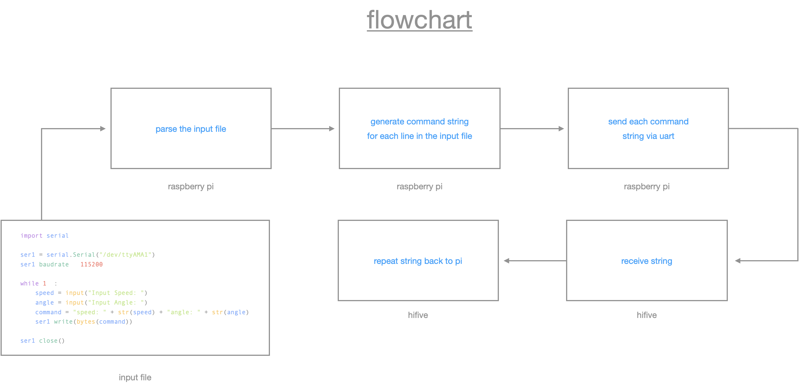

#  milestone 02

###  teammates

1. [Morgan Maha Bergen](https://github.com/MorganBergen)
2. [Saje Ein Cowell](https://github.com/sajeyyy)
3. [Collins Gatimi](https://github.com/Gatimio)
4. [Charlie Gillund](https://github.com/ChuckGills)

###  contents 

1.  [general](#general)
2.  [commands in pseudo](#commands-in-pseudo)
3.  [tasks](#tasks)
4.  [submission](#submission)

what is this error

```bash
m358b583@ENGR3002-18:~/Documents/eecs388/embedded-systems/src/milestone02/src$ python3 milestone2.csv 
m358b583@ENGR3002-18:~/Documents/eecs388/embedded-systems/src/milestone02/src$ python3 prog.py 
Traceback (most recent call last):
  File "/home/c112h406/.platformio/penv/lib/python3.10/site-packages/serial/serialposix.py", line 322, in open
    self.fd = os.open(self.portstr, os.O_RDWR | os.O_NOCTTY | os.O_NONBLOCK)
FileNotFoundError: [Errno 2] No such file or directory: '/dev/ttyAMA1'

During handling of the above exception, another exception occurred:

Traceback (most recent call last):
  File "/home/m358b583/Documents/eecs388/embedded-systems/src/milestone02/src/prog.py", line 5, in <module>
    ser1 = serial.Serial("/dev/ttyAMA1", 115200)
  File "/home/c112h406/.platformio/penv/lib/python3.10/site-packages/serial/serialutil.py", line 244, in __init__
    self.open()
  File "/home/c112h406/.platformio/penv/lib/python3.10/site-packages/serial/serialposix.py", line 325, in open
    raise SerialException(msg.errno, "could not open port {}: {}".format(self._port, msg))
```

##  general

instead of using terminals, you will now create a python program on the pi to communicate with the hifive.  your task is to send formatted command strings to the hifive that can control the steering angle, speed, and duration of a command.  these commands will be supplied from a **csv** file on the pi.  in this milestone, you will implement the necessary code for parsing that input file and sending the correct values to the hifive from the pi.

the following flowchart describes this milestone:



a "command" consists of a speed value and a steering angle value that the car should be set to, and a duration value for how long to hold that configuration.  the commands in the input csv file will have the following format

### command format `<angle value>, <speed value>, <duration>`

-  the angle value will be an integer between -45 and 45
-  the speed value will be 1, 2, 3 for driving forward at different speeds
-  the speed value will be -1, -2, -3 for drive backward at different speeds
-  the duration will be the time, in _seconds_, for which that command should run

### command literal `30, 2, 3`

the command above means the car should steer to 30 degrees, move forward with speed flag 2, and hold this configuration for 3 seconds.  to read in the input file you can use python's **csv** library.  [here is a tutorial to on how ot use the csv library](https://realpython.com/python-csv/) for reference.  

a csv file is a commana separated values file, a type of plain text file that uses specific structuring to arrange tabular data.  because it's a plain text file, it can contain only actual etxt data aka printable ASCII or unicode characters.

```
column 1 name, column 2 name, column 3 name
first row data 1, first row data 2, first row data 3
second row data 1, second row data 2, second row data 3
```

each piece of data is separated by a comma.  normally the first line identifies each piece of data - in other words the nae of a data column.  every subsequent line after that is actual data and is limited only by file size constraints.  in general, the separator character is called a delimiter, and the comma is not the only one used. other popular delimiters include the tab (\t), colon (:) and semi-colon (;) characters. properly parsing a CSV file requires us to know which delimiter is being used.

after reading these values in from the input file on the pi, you will generate your command strings conatining the information you collected to be sent to the hifive.  the actual format of the command string is up to you; you can send them as is (i,e. as a string containing three values separated by commas), add additional text to indicate each parameter or you can use the sample format you will find below.

###  csv library

the csv file is done using the reader object.  the csv file is opened as a text file with python's built-in `open()` functiopn, which returns a file object.  this is then passed to the reader, which does does the heavy lifting.

```
import csv
import serial
import time

# Open a serial connection to /dev/ttyAMA1
ser1 = serial.Serial("/dev/ttyAMA1", 115200)

# Open the CSV input file
csv_filename = "milestone2.csv"  # Replace with the correct filename
with open(csv_filename, newline='') as csv_file:
    csv_reader = csv.reader(csv_file, delimiter=',')
    
    # Iterate through each row in the CSV file
    for row in csv_reader:
        # Read angle value, speed value, and duration value
        angle = row[0]
        speed = row[1]
        duration = float(row[2])
        
        # Create the command string
        command_str = f"angle:{angle},speed:{speed},duration:{duration}"
        
        # Write the command to /dev/ttyAMA1
        ser1.write(command_str.encode())
        
        # Wait for the duration of the command before sending the next one
        time.sleep(duration)

# Close the serial connection
ser1.close()
```

after generating a command string, you will need to send it via the serial connection **uart** to the hifive from the pi.  at the hifive end, you will need to read in these command strings being sent from the pi and repeat them back to the pi using a different uart commection similar to what we did in this [board to board communication](../lab09/).

the following pseudo-code provides a general idea of the code you will need to write

##  commands in pseudo

```python
#  pseudo code
open a serial connection to /dev/ttyAMA1
open csv input file
for each line in input file:
    read angle value    -> angle
    read speed value    -> speed
    read duration value -> duration 
    command_str = "angle: " + angle + "speed: " + speed + "duration: " + duration
    write command to /dev/ttyAMA1
close serial connection
```

to achieve the functionality from above, you need to use pythons `pySerial` api which can be used by importing the `serial` package.  view tutorial [here](https://pyserial.readthedocs.io/en/latest/shortintro.html) 

###  `import serial`

with pySerial, you should create a serial channel for writing to the hifive over `/dev/ttyAMA1`.  note that the channel should be opened with the baudrate `115200` bps.

###  `ser1 = serial.Serial(...)`

the command strings you generate can then be sent to the hifive by using the serial write function:

###  `ser1.write(command_str)`

however, the **write** function requires a byte value, which must be formed from whatever type your command variable is in order to send it to the hifive.

###  `ser1.write(bytes(command_str))`

finally, after all of the commands are sent, the serial commections can be closed by invoking the serial close function 

###  `ser1.close()`

##  tasks 

1.  wire up the hifive and the pi the way you did for lab 9 [board to board communication](../lab09/) 
2.  on the hifive use the same program you wrote for lab 9 [board to board communication](../lab09/) for communicating between the hifive and raspeberry pi.  build and upload it to the hifive to get it ready to receive the command strings from the pi.
3.  on the pi, create a python source file called `prog.py` and write your python code inside this file.
4.  download the input csv file, you need to read this file in your python code to get the commands.
5.  open a new terminal window and run the screen command which receives characters (i.e. run screen with `/dev/ttyAMA2`) run your python program and demonstrate the transferring of information. execute the program as `python prog.py` 

##  submission

`prog.py`


